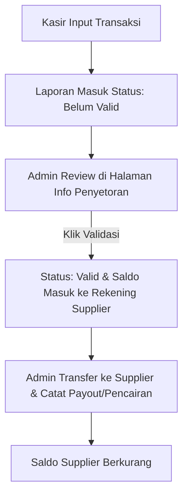

# Review JjsManage v2.9.0 🚀
**Sistem Manajemen Konsinyasi Jajanan Subuh (Sukabumi)**

JjsManage adalah aplikasi berbasis web modern (Next.js, Tailwind CSS, PostgreSQL, & Prisma) yang dirancang khusus untuk mengelola operasional toko konsinyasi makanan/kue subuh. Aplikasi ini menghubungkan pihak **Pengelola Toko (Admin/Kasir)** dengan **Mitra UMKM (Supplier)** secara transparan, real-time, dan mudah digunakan (mobile-first).

Berikut adalah penjelasan fungsi, alur kerja, dan manfaat sistem dari dua sudut pandang pengguna utama: **Admin** dan **Supplier**.

---

## 1. Perspektif ADMIN (Pengelola Toko)

Admin memiliki kendali penuh atas sistem, mulai dari data master, verifikasi penjualan, pencatatan keuangan toko, hingga pencetakan label produk.

### 📋 Fitur Utama & Halaman Admin
*   **Dashboard Utama**: 
    *   **Statistik Global**: Menampilkan grafik total omzet penjualan, laba bersih bagian toko (20% share), jumlah suplier aktif, dan jumlah kasir terdaftar.
    *   **Top Suppliers**: Daftar peringkat suplier dengan penjualan/omset tertinggi untuk membantu analisis performa mitra.
*   **Data Master (`/master`)**: Mengelola akun kasir, data suplier (nama pemilik, info bank, nomor rekening), produk, dan hak akses pengguna.
*   **Transaksi & Laporan Harian (`/transactions`)**: Halaman untuk kasir menginput data penjualan harian dari kasir fisik ke sistem online.
*   **Info Penyetoran (`/deposits` - Halaman Setor)**:
    *   Menampilkan rekapitulasi dana penjualan harian suplier yang **siap disetorkan/ditransfer**.
    *   **Validasi Transaksi**: Admin dapat memverifikasi laporan harian. Setelah divalidasi, saldo 80% bagian suplier akan otomatis masuk ke **Saldo Siap Tarik (Validated Balance)** suplier.
    *   Ekspor data penyetoran ke format **Excel** untuk mempermudah transfer bank massal.
*   **Tabungan Mitra (`/savings`)**: Memantau saldo tabungan yang dikumpulkan dari potongan otomatis penjualan suplier untuk tabungan cadangan.
*   **Manajemen Antrean Cetak (`/cetak`)**:
    *   Melihat semua request pencetakan label barcode produk dari suplier secara terpusat.
    *   Ekspor antrean cetak ke Excel (yang nantinya diimpor ke software printer barcode).
    *   Menandai cetakan yang sudah selesai (`DONE`) dan melihat **Riwayat Cetak Global** berdasarkan tanggal/suplier.

### 🔄 Alur Kerja Keuangan Admin

### 🌟 Manfaat Bagi Admin
1.  **Mengurangi Human Error**: Perhitungan bagi hasil otomatis (80% Supplier : 20% Toko) mencegah kesalahan hitung manual.
2.  **Efisiensi Pencetakan Barcode**: Antrean cetak terpusat memudahkan admin memproduksi ribuan stiker label produk tanpa perlu input manual satu per satu.
3.  **Rekonsiliasi Cepat**: Validasi terstruktur membuat pencatatan uang masuk dan uang keluar toko menjadi rapi dan mudah diaudit.

---

## 2. Perspektif SUPPLIER (Mitra UMKM)

Supplier adalah pembuat makanan/kue subuh. Mereka membutuhkan transparansi penuh terhadap barang yang mereka titipkan, sisa saldo yang belum dibayar, riwayat cetak barcode, dan potongan tabungan mereka.

### 📋 Fitur Utama & Halaman Supplier
*   **Dashboard Terpersonalisasi**:
    *   **Omzet Penjualan**: Total nilai penjualan produk mereka sendiri.
    *   **Mitra Jjs (Laba 80%)**: Pendapatan bersih yang menjadi hak suplier.
    *   **Total Tabungan**: Saldo tabungan suplier yang terakumulasi.
    *   **Saldo Saat Ini**: Sisa dana yang belum dicairkan oleh toko (dengan tombol pintas untuk melihat riwayat pencairan).
    *   **Grafik Tren Pendapatan**: Grafik visual untuk memantau naik-turunnya penjualan harian mereka.
*   **Info Saldo (`/deposits` - Halaman Saldo)**:
    *   Suplier dapat melihat secara rinci total penjualan harian mereka yang berstatus **Sudah Divalidasi** (siap ditransfer) maupun yang **Belum Divalidasi** oleh admin.
    *   Transparansi detail rekening bank tujuan transfer.
*   **Tabungan Mitra (`/savings`)**:
    *   Melihat total akumulasi tabungan harian mereka.
    *   Melihat rincian riwayat pemotongan tabungan per nota penjualan.
*   **Pencetakan Label Mandiri (`/cetak`)**:
    *   Suplier dapat memilih produk mereka, memasukkan jumlah kuantitas stiker label yang dibutuhkan, lalu klik **Kirim Antrean** ke admin.
    *   Melihat riwayat cetak stiker mereka yang telah selesai dikerjakan admin.
*   **Riwayat Pencairan (`/payouts`)**:
    *   Laporan riwayat penarikan dana/transfer dari toko ke rekening suplier untuk mencocokkan mutasi rekening bank mereka.

### 🌟 Manfaat Bagi Supplier
1.  **Transparansi Finansial**: Supplier bisa langsung memantau berapa kue mereka yang laku hari ini tanpa harus menunggu laporan fisik di akhir bulan.
2.  **Sistem Tabungan Otomatis**: Membantu UMKM menyisihkan sebagian keuntungan kecil mereka sebagai tabungan usaha tanpa repot.
3.  **Kemudahan Labeling**: Mempercepat proses penyiapan produk dengan memesan barcode stiker secara mandiri langsung dari aplikasi ponsel mereka.

---

## 💡 Ringkasan untuk Dijelaskan ke Orang Lain (Pitching Point)

> *"**JjsManage** adalah sistem jembatan antara **Toko Jajanan Subuh** dengan **Ratusan Mitra UMKM kue**. Untuk **Supplier**, aplikasi ini adalah asisten keuangan pribadi yang menampilkan omzet secara real-time, jumlah saldo siap cair, tabungan otomatis, dan pemesanan barcode produk. Sedangkan bagi **Admin**, aplikasi ini adalah dashboard kendali untuk memvalidasi setoran harian, memantau bagi hasil 20% toko secara otomatis, mencatat pembayaran, dan mengelola cetak barcode label secara masal dan efisien."*
